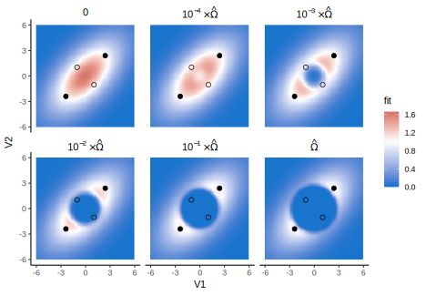
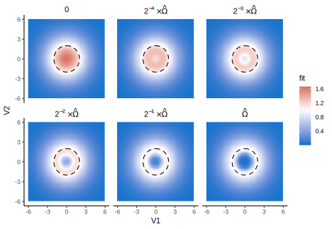
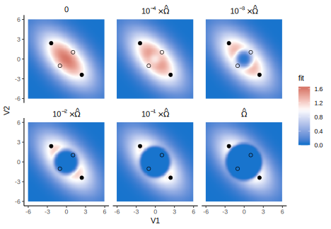

Fitness landscapes
================
Lucas A. Nell
01 Mar 2019

``` r
suppressPackageStartupMessages({
    library(tidyverse)
    library(sauron)
    library(ggforce)
})
```

## Required functions

``` r
fitness <- function(V1, V2, eta, Ni, f = 0.1, a0 = 0.5, r0 = 0.5) {
    C <- matrix(eta, 2, 2)
    Vi <- cbind(V1, V2)
    diag(C) <- 1
    exp(r0 - f * Vi %*% C %*% t(Vi) - a0 * exp(- Vi %*% t(Vi)) * Ni)
}
# Omega at stable points
O_eq <- function(eta, f = 0.1, a0 = 0.5, r0 = 0.5) {
    rho <- ifelse(eta < 0, f * (1 + eta), f * (1 - eta))
    (rho / a0) * exp((r0 / rho) - 1)
}
# Stable points:
stable_points <- function(eta, f = 0.1, a0 = 0.5, r0 = 0.5) {
    if (eta < 0) {
        rho <- f * (1 + eta)
        xy <- c(-1, 1) * sqrt((r0 - rho) / (2 * rho))
        pts <- tibble(V1 = xy, V2 = xy)
        geom <- geom_point(data = pts, aes(V1, V2), color = "black")
    } else if (eta > 0) {
        rho <- f * (1 - eta)
        xy <- c(-1, 1) * sqrt((r0 - rho) / (2 * rho))
        pts <- tibble(V1 = xy, V2 = rev(xy))
        geom <- geom_point(data = pts, aes(V1, V2), color = "black")
    } else {
        radius <- sqrt((r0 - f) / f)
        geom <- geom_circle(data = tibble(x0 = 0, y0 = 0, r = radius),
                            aes(x0 = x0, y0 = y0, r = r), linetype = 2)
    }
    return(geom)
}
# Unstable points:
unstable_points <- function(eta, f = 0.1, a0 = 0.5, r0 = 0.5) {
    if (eta < 0) {
        rho <- f * (1 - eta)
        xy <- c(-1, 1) * sqrt((r0 - rho) / (2 * rho))
        pts <- tibble(V1 = xy, V2 = rev(xy))
        geom <- geom_point(data = pts, aes(V1, V2), color = "black", shape = 1)
    } else if (eta > 0) {
        rho <- f * (1 + eta)
        xy <- c(-1, 1) * sqrt((r0 - rho) / (2 * rho))
        pts <- tibble(V1 = xy, V2 = xy)
        geom <- geom_point(data = pts, aes(V1, V2), color = "black", shape = 1)
    } else {
        geom <- geom_blank()
    }
    return(geom)
}

fitness_landscape <- function(eta_, max_mag = 6) {
    if (eta_ != 0) {
        mults <- c(10^(-4:0))
        labs <- c("0", sprintf("10^{%i} %%*%% hat(Omega)", -4:-1),
                  "hat(Omega)")
    } else {
        mults <- c(1 / (2^(4:1)), 1)
        labs <- c("0", sprintf("2^{%i} %%*%% hat(Omega)", log2(head(mults, -1))),
                  "hat(Omega)")
    }
    hm_df <- crossing(V1 = seq(-max_mag, max_mag, length.out = 100), 
                      V2 = seq(-max_mag, max_mag, length.out = 100),
                      Ni = c(0, O_eq(eta_) * mults)) %>% 
        mutate(fit = pmap_dbl(list(V1, V2, Ni),
                              ~ fitness(..1, ..2, eta = eta_, Ni = ..3))) %>% 
        mutate(Ni = factor(Ni, labels = labs))
    
    hm_df %>% 
        ggplot() +
        geom_raster(aes(V1, V2, fill = fit), interpolate = FALSE) +
        stable_points(eta_) +
        unstable_points(eta_) +
        facet_wrap(~ Ni, nrow = 2, labeller = label_parsed) +
        scale_fill_gradient2(high = "firebrick", low = "dodgerblue3", mid = "white", midpoint = 1)
}
```

``` r
plots <- map(c(-0.6, 0, 0.6), fitness_landscape)
```

### When eta \< 0

<!-- -->

### When eta == 0

<!-- -->

### When eta \> 0

<!-- -->
